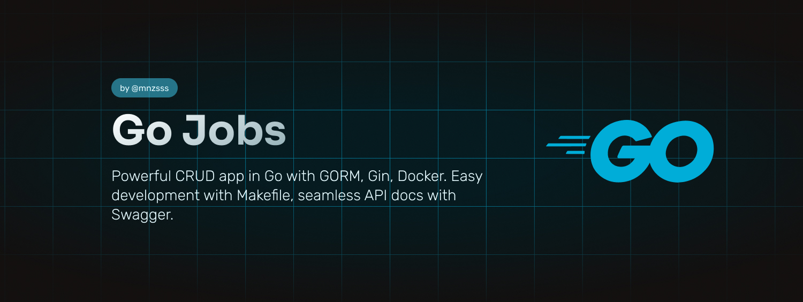

# Go Jobs

The CRUD Project with GORM, PostgreSQL, Gin, Gin-Swagger, Swag, Makefile, Docker, and Docker Compose for study purposes about Go.

## Overview

This project implements a CRUD in Go using the following technologies:

On start, this project implements a CRUD in Go using the following technologies:

- 🗃️ **GORM:** ORM (Object Relational Mapper) for interacting with the PostgreSQL database. 
- 🐘 **PostgreSQL:** Relational database used to store CRUD data. 
- 🌐 **Gin:** Web framework for building APIs in Go. 
- 📚 **Gin-Swagger:** Middleware for integrating Swagger with the Gin API. 
- 📖 **Swag:** Tool for generating Swagger documentation for Go APIs.
- 🛠️ **Makefile:** Simplifies common development tasks.
- 🐳 **Docker:** Containerization for isolation and distribution of the application.
- 🚢 **Docker Compose:** Container orchestration for development environments.

## Installation

Ensure you have Go, Docker, and Docker Compose installed on your system.

### Swag (Swagger) Installation

```bash
# Install Swag globally
go get -u github.com/swaggo/swag/cmd/swag

# Add Go's path to your shell (bash or zsh)
export PATH=$PATH:$(go env GOPATH)/bin
export PATH=$PATH:$(go env GOROOT)/bin
```

Need improvements to auto generate the Swagger documentation on change files inside docker, but for now, you can run the command below to generate the Swagger documentation:  

```bash
make docs
```

And up docker compose again.

### Locally

```bash
# 1. Clone the repository
git clone https://github.com/mnzsss/go-jobs.git

# 2. Navigate to the project directory
cd go-jobs

# 3. Setup the environment variables
cp .env.example .env

# 4. Run the application locally
# By default the application will run on port 8080 with run-with-docs command
make
```

### Docker

Run docker compose with Auto Rebuilding:

```bash
# 1. Clone the repository
git clone https://github.com/mnzsss/go-jobs.git

# 2. Navigate to the project directory
cd go-jobs

# 3. Run the application using Docker Compose
docker-compose up
```

Access the Swagger route in the container: [Local Docs](http://localhost:8080/swagger/index.html)

### Makefile Tasks

Here are some common tasks you can perform using the Makefile:

- `make run`: Run the Go application locally.
- `make run-with-docs`: Run the Go application with Swagger documentation.
- `make build`: Build the Go application.
- `make test`: Run tests for the project.
- `make docs`: Generate Swagger documentation for the API.
- `make clean`: Clean up generated files and artifacts.

## Contributing

Thank you for considering contributing to this project! We welcome contributions from the community to improve and enhance the project. To contribute, please follow the guidelines below:

### Issues

- If you find a bug or have a suggestion, please [open an issue](https://github.com/mnzsss/go-jobs/issues).
- Check if an issue already exists before creating a new one.

### Pull Requests

1. Fork the repository.
2. Create a new branch: `git checkout -b feature-or-fix`.
3. Make your changes and commit them: `git commit -m 'Description of changes'`.
4. Push to the branch: `git push origin feature-or-fix`.
5. Submit a pull request with a clear title and description.

### Coding Standards

Please adhere to the coding standards used in the project. If in doubt, refer to the existing codebase.

### Testing

Ensure that your changes do not break existing functionality. If applicable, include new tests for your features.

### Documentation

Update the documentation if your changes impact the project's usage or behavior. This includes the README, inline code comments, or any other relevant documentation.

### License

By contributing, you agree that your contributions will be licensed under the [MIT License](LICENSE).

Thank you for contributing to this project!
